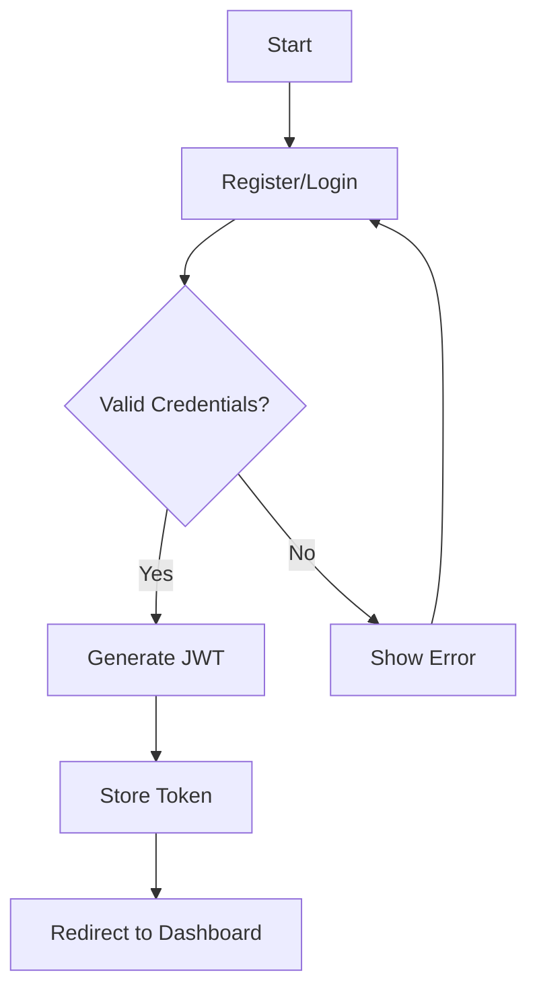
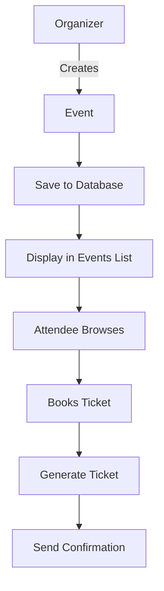

# EventCraft - Event Management System

A comprehensive event management platform built with MERN stack (MongoDB, Express.js, React, Node.js) that enables users to create, discover, and manage events with ease.

## 📋 Table of Contents
- [System Architecture](#-system-architecture)
- [Features](#-features)
- [Tech Stack](#-tech-stack)
- [Database Schema](#-database-schema)
- [API Documentation](#-api-documentation)
- [Workflows](#-workflows)
- [Flowcharts](#-flowcharts)
- [Getting Started](#-getting-started)
- [Deployment](#-deployment)
- [Future Enhancements](#-future-enhancements)

## 🏗️ System Architecture

### Frontend (Client)
- **Framework**: React 19 with Vite
- **State Management**: React Context API
- **Routing**: React Router v6
- **UI Components**: Tailwind CSS
- **Data Visualization**: Recharts
- **HTTP Client**: Axios
- **Form Handling**: React Hook Form
- **Authentication**: JWT (stored in localStorage)

### Backend (Server)
- **Runtime**: Node.js with Express.js
- **Database**: MongoDB with Mongoose ODM
- **Authentication**: JWT (JSON Web Tokens)
- **Security**: bcryptjs, helmet, cors
- **Validation**: express-validator
- **File Upload**: multer
- **Email**: Nodemailer

## ✨ Features

### User Roles
- **Attendee**: Browse events, book tickets, manage RSVPs
- **Organizer**: Create and manage events, track registrations
- **Admin**: Manage users, events, and platform settings

### Core Functionality
- User authentication and authorization
- Event creation and management
- Ticket booking and RSVP system
- Event discovery with filters
- User profiles and dashboards
- Admin dashboard for platform management

## 🗃️ Database Schema

### User
```javascript
{
  name: String,
  email: { type: String, unique: true },
  password: String,
  role: { type: String, enum: ['attendee', 'organizer', 'admin'] },
  avatar: String,
  bio: String,
  events: [{ type: Schema.Types.ObjectId, ref: 'Event' }],
  tickets: [{ type: Schema.Types.ObjectId, ref: 'Ticket' }],
  createdAt: Date,
  updatedAt: Date
}
```

### Event
```javascript
{
  title: String,
  description: String,
  date: Date,
  location: String,
  category: String,
  imageUrl: String,
  price: Number,
  capacity: Number,
  organizer: { type: Schema.Types.ObjectId, ref: 'User' },
  attendees: [{ type: Schema.Types.ObjectId, ref: 'User' }],
  isPublished: Boolean,
  createdAt: Date,
  updatedAt: Date
}
```

### Ticket
```javascript
{
  event: { type: Schema.Types.ObjectId, ref: 'Event' },
  user: { type: Schema.Types.ObjectId, ref: 'User' },
  type: String,
  price: Number,
  bookingDate: Date,
  status: { type: String, enum: ['confirmed', 'cancelled', 'refunded'] },
  qrCode: String
}
```

## 📚 API Documentation

### Authentication
- `POST /api/auth/register` - Register a new user
- `POST /api/auth/login` - User login
- `GET /api/auth/me` - Get current user profile

### Events
- `GET /api/events` - Get all events
- `GET /api/events/:id` - Get event by ID
- `POST /api/events` - Create new event (Organizer/Admin only)
- `PUT /api/events/:id` - Update event
- `DELETE /api/events/:id` - Delete event

### Users
- `GET /api/users` - Get all users (Admin only)
- `GET /api/users/:id` - Get user by ID
- `PUT /api/users/:id` - Update user
- `DELETE /api/users/:id` - Delete user (Admin only)

### Bookings
- `POST /api/bookings` - Create new booking
- `GET /api/bookings/user/:userId` - Get user's bookings
- `DELETE /api/bookings/:id` - Cancel booking

## 🔄 Workflows

### User Authentication
1. User registers with email/password
2. System validates input and creates user account
3. User logs in with credentials
4. Server validates credentials and issues JWT
5. Client stores JWT for authenticated requests

### Event Creation
1. Organizer fills event details
2. System validates input and creates event
3. Event is saved to database
4. Organizer can manage event from dashboard

### Ticket Booking
1. User browses events
2. Selects event and ticket type
3. Completes booking form
4. System processes payment (stripe integration)
5. Booking is confirmed and ticket is generated
6. User receives confirmation email

## 📊 Flowcharts

### User Authentication


### Event Management


## 🚀 Getting Started

### Prerequisites
- Node.js v18+
- MongoDB v6+
- npm or yarn

### Installation

1. Clone the repository:
```bash
git clone https://github.com/priyanshuyadav48/eventcraft.git
cd eventcraft
```

2. Install dependencies:
```bash
# Install server dependencies
cd server
npm install

# Install client dependencies
cd ../client
npm install
```

3. Environment Setup:
Create `.env` files in both `server` and `client` directories with required variables.

4. Start the application:
```bash
# Start backend (from server directory)
npm run dev

# Start frontend (from client directory)
npm run dev
```

## 🌐 Deployment

### Backend Deployment
1. Set up MongoDB Atlas or self-hosted MongoDB
2. Configure environment variables
3. Deploy to platforms like:
   - Heroku
   - Render
   - AWS Elastic Beanstalk
   - DigitalOcean

### Frontend Deployment
1. Build for production:
```bash
cd client
npm run build
```
2. Deploy to:
   - Vercel
   - Netlify
   - GitHub Pages
   - AWS S3 + CloudFront

## 🚀 Future Enhancements

### Planned Features
- Real-time notifications
- Chat system for event discussions
- Event recommendations
- Social media integration
- Advanced analytics dashboard
- Mobile app (React Native)
- Payment gateway integration
- Multi-language support

### Performance Improvements
- Implement caching with Redis
- Add GraphQL API layer
- Optimize database queries
- Implement CDN for static assets

## 🙏 Acknowledgments

- [React](https://reactjs.org/)
- [Express.js](https://expressjs.com/)
- [MongoDB](https://www.mongodb.com/)
- [Tailwind CSS](https://tailwindcss.com/)

---

<div align="center">
  Made with ❤️ by Priyanshu & Manik 
</div>

3. Set up environment variables:
Create a `.env` file in the server directory with the following variables:
```
MONGODB_URI=your_mongodb_uri
JWT_SECRET=your_jwt_secret
PORT=5000
```

### Running the Application

1. Start the server:
```bash
cd server
npm run dev  # For development
# or
npm start    # For production
```

2. Start the client:
```bash
cd client
npm run dev
```

The application will be available at `http://localhost:5173` (client) and `http://localhost:5000` (server).

## Features

- Event creation and management
- User authentication and authorization
- QR code generation for event tickets
- Event scheduling with calendar integration
- Real-time analytics and reporting
- Email notifications
- Mobile-responsive design

## Contributing

1. Fork the repository
2. Create your feature branch (`git checkout -b feature/AmazingFeature`)
3. Commit your changes (`git commit -m 'Add some AmazingFeature'`)
4. Push to the branch (`git push origin feature/AmazingFeature`)
5. Open a Pull Request

## License

This project is licensed under the ISC License - see the LICENSE file for details.

## Contact

For support or questions, please open an issue in the repository.
